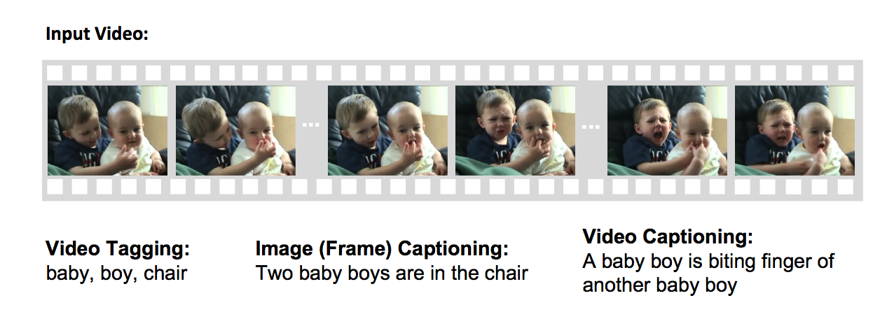

This blog post is a study note summary for the paper [Deep Learning for Video Classification and Captioning](https://arxiv.org/abs/1609.06782) published by Zuxuan Wu, Ting Yao, Yuanwei Fu, and Yu-Guang Jiang in 2016.

## Video Captioning
Different from video classification, the goal of video captioning is to automatically generate a complete and natural sentence to a video, making it a a lot more complicated problem because it involve not only the research on video understanding but also natural language processing.

There is also a difference between video tagging and video captioning. Video tagging is to describe what is the video, and it can also extend to where the objects are, while video captioning is trying to use natural sentence to describe what the objects in the videos are interacting to each other, attempting to extract more in-depth meanings from the context of the video.

There is a picture in the original paper explain this very well:

Recent development in translation has inspired many good research in the field despite the fact this it is a very difficult problem. In general, CNNs are used to extract visual representation on the videos and RNNs (LSTM) are used to general natural languages.

There are mainly two directions for video captioning: template-based language model, and sequence learning model (RNNs).

The paper also discuss about the research and methodologies to approach the two models and the architectures of a typical video captioning system (section 4.2 - 4.3).

## Databases, benchmarks and competitions
The authors also list many useful resources to the problem, mainly databases and competitions.

Some of the databases and competitions are for video classification and some of them are for video captioning.
